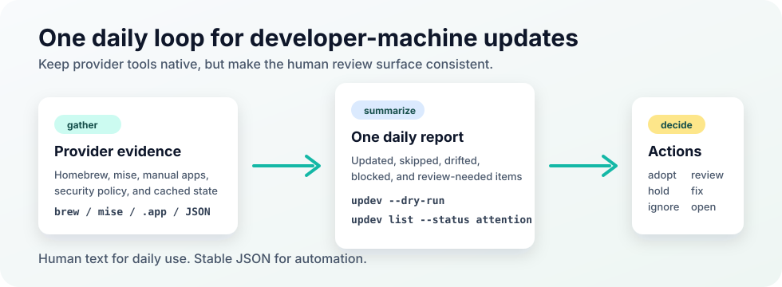

# updev

`updev` is a control plane for developer-machine updates, inventory, and
supply-chain review. It keeps Homebrew, mise, and future provider tools native,
but puts one command, one safety gate, and one review queue around machine
changes.

The current public preview is intentionally narrow: macOS, Homebrew, mise, and
manual/vendor app inventory are the supported focus. Linux and Windows binaries
are published for early testing, but broad package-provider support is still
experimental.



`updev` is built for machines that already use real provider tools. Providers
still do the installing; `updev` gives you the operator view around them:

- **One operator surface**: preview updates, list installed state, inspect
  drift, and run provider actions without memorizing every provider command.
- **Human-first review**: compact text and TTY selectors keep routine checks
  readable, while detail views and JSON stay available when you need evidence.
- **Safety before mutation**: release-age holds, advisory checks, provenance
  review, and strict mode make risky updates visible before they change the
  machine.
- **Native-provider friendly**: Homebrew and mise stay the source of execution;
  `updev` coordinates, explains, and records decisions around them.
- **Low setup pressure**: built-in defaults work without writing a config file;
  TOML is only needed when you want policy or UI overrides.

## Why updev?

Developer machines drift because each tool has its own update command,
desired-state file, safety model, and review output. `updev` sits above those
providers and keeps maintenance readable whether you run it on demand, on a
schedule, or before/after a machine change:

- run one update/check command instead of remembering provider-specific flows;
- compare desired manifests with live installed state;
- browse package state through a readable `updev list` view with filters,
  details, and JSON for automation;
- identify unmanaged or manually installed apps without immediately adopting
  them;
- add safety gates for risky package, cask, and extension updates;
- recommend provider/backend improvements, such as moving suitable CLI tools
  toward mise when appropriate.

The result is a quieter update workflow: package managers keep their native
behavior, while humans get a consistent report, explicit holds, a focused
review queue, and JSON output for automation.

## What stands out

- `updev list` is designed for scanning: grouped sections, concise status text,
  focused filters, and `--details` when a row needs investigation.
- Safety gates explain *why* an update is allowed, held, blocked, or needs
  review instead of only hiding it behind a generic failure.
- Manual/vendor app inventory is review-first. It can surface local-only apps,
  cask/Mac App Store ownership evidence, and adoption candidates without
  automatically taking over the machine.
- The same commands work in terminals and automation: color-aware human output
  for interactive runs, `--no-color` and JSON for scripts.
- Configuration is additive. A default-only `config.toml` is not created or
  required, which keeps first-run setup small.

## Features

- **Main update workflow**: `updev` and `updev --dry-run` summarize updates,
  drift, skipped work, warnings, holds, and next actions.
- **Supply-chain safety gates**: hold package or extension updates that are too
  new, policy-blocked, advisory-matched, or missing release-age/provenance
  evidence. Strict mode can stop mutation until evidence is good enough.
- **Readable inventory**: `updev list` is a first-class review surface for
  desired/live package and runtime state. It groups by provider, category, and
  status, stays compact by default, and adds focused filters, detail views, and
  JSON when you need to drill in.
- **Desired-state checks**: `updev check`, `updev sync`, and `updev status`
  find missing, extra, drifted, blocked, and unavailable entries.
- **mise hygiene**: `updev fix mise` previews rewrites for unsafe `latest` pins
  while keeping Node `lts` as the only allowed LTS shortcut.
- **Security review**: `updev security scan`, `gate`, `review`, and `policy`
  turn findings into allow/hold/review/block decisions and machine-readable
  evidence.
- **Manual/vendor app inventory**: `updev inventory scan|plan|review
  --provider manual` finds macOS `.app` bundles, Mac App Store evidence,
  Homebrew cask ownership, and local-only apps that need a decision.
- **Interactive or scriptable UX**: TTY runs can open compact selectors and
  detail views; scripts can use `--format json`, `--no-color`, and focused
  filters.

## Install

Quick shell install:

```bash
curl -fsSL https://raw.githubusercontent.com/webkaz-labs/updev/main/scripts/install.sh | sh
```

This installs the latest GitHub release to `~/.local/bin/updev` and verifies the
release checksum before copying the binary. To pin a release or choose another
directory:

```bash
curl -fsSL https://raw.githubusercontent.com/webkaz-labs/updev/main/scripts/install.sh |
  sh -s -- --version vX.Y.Z --install-dir ~/.local/bin
```

Managed with mise:

```bash
mise use -g github:webkaz-labs/updev@vX.Y.Z
updev version
```

This writes a pinned release entry to your global mise config:

```toml
[tools]
"github:webkaz-labs/updev" = "vX.Y.Z"
```

Replace `vX.Y.Z` with the resolved latest release tag. Avoid storing `latest`
for this tool: `updev` treats unpinned mise versions as unsafe in managed
manifests.

To try `updev` without changing your mise config:

```bash
mise x github:webkaz-labs/updev -- updev version
```

You can also install from source with Go:

```bash
go install github.com/webkaz-labs/updev@latest
```

Release archives and checksums are available on
[GitHub Releases](https://github.com/webkaz-labs/updev/releases). Tag-specific
release notes are kept in [`docs/release-notes`](docs/release-notes).

## Provider Assumptions

`updev` does not replace provider CLIs. It shells out to the provider tools you
already use, and provider support assumes those commands are installed,
authenticated where needed, and visible on `PATH`.

| Area | Requirement |
|------|-------------|
| macOS preview | Homebrew and mise installed locally. |
| Homebrew provider | `brew` must support JSON output such as `brew outdated --json=v2`; package mutation still runs through Homebrew. |
| mise provider | `mise` must support `mise ls --current --json --cd <dir>` for inventory and the GitHub backend for the managed install example. `updev` currently validates exact pins and rejects unsafe `latest` entries; it does not require, add, or enforce a mise-native age setting. |
| Manual app inventory | macOS `.app` bundle metadata is read locally; Mac App Store evidence is used only when receipts or `mas` evidence are available. |
| Security gates | Network evidence is best-effort and provider-scoped. Strict mode can hold Homebrew updates and opt-in VS Code extension updates when required evidence is missing. |

Known-good validation as of 2026-06-04:

| Tool | Verified version/path |
|------|-----------------------|
| macOS | primary supported preview platform. |
| Homebrew | `5.1.14-199-g863696a` locally; CI uses mocked provider output. |
| mise | `2026.5.18` locally; GitHub backend install smoke is covered separately. |
| Go | module and repository mise config pin `go 1.25.8`. |
| GitHub Actions | CI and release workflows use GitHub-maintained Node 24 action majors. |

These are validation anchors, not permanent minimum versions. If a newer
provider changes output shape or command behavior, `updev` should mark that
provider/version unsupported until the parser, tests, and docs are updated.

## Quick Start

Preview the workflow safely, then run the main command:

```bash
updev --dry-run
updev
```

Review what needs attention:

```bash
updev list
updev list --status attention
updev list --provider brew --details
updev security review
```

Run consistency checks:

```bash
updev check
updev sync
updev doctor dependencies
```

Review manual/vendor macOS apps:

```bash
updev inventory scan --provider manual
updev inventory plan --provider manual
updev inventory review --provider manual
```

Use JSON for automation:

```bash
updev list --format json
updev security gate --format json
updev inventory plan --provider manual --format json
```

## Supply-Chain Review

`updev` can evaluate pending updates before mutation. It can hold or require
review for:

- Homebrew releases and VS Code extension updates that are newer than the
  configured updev age threshold;
- Homebrew casks, URL casks, and non-official taps that need provenance review;
- advisory matches from OSV or GitHub Advisory evidence where package identity
  is reliable;
- VS Code extension updates when marketplace age/posture checks are enabled;
- local policy rules such as temporary allow, hold, review, or block decisions.

Use `warn` mode for visibility and `strict` mode when missing or risky evidence
should hold the update. mise inventory and manifest hygiene are checked today.
When mise `minimum_release_age` is configured, mise applies that policy while
resolving versions; updev should report that effective policy before adding its
own mise update gate.

## Common Commands

| Command | Purpose |
|---------|---------|
| `updev` | Run the update workflow. |
| `updev --dry-run` | Preview the update workflow without applying updates. |
| `updev list` / `updev ls` | Show grouped desired/live inventory. |
| `updev status` / `updev st` | Show compact current state. |
| `updev check` / `updev ck` | Validate manifests and provider consistency. |
| `updev sync` | Compare desired and live state without mutating. |
| `updev last` | Re-open the cached last update report. |
| `updev fix mise` | Preview or apply safe mise manifest pin fixes. |
| `updev security scan` | Run explicit broad security checks. |
| `updev security gate` | Evaluate pending update safety. |
| `updev security review` | Inspect findings that require a decision. |
| `updev security policy` | List or edit safety policy overrides. |
| `updev inventory plan --provider manual` | Group manual app decisions. |
| `updev version` / `updev -v` | Print the current CLI version. |

## Configuration

Most users do not need an `updev` config file. Built-in defaults are used when
the file is missing, and `updev` does not create `config.toml` just to write
default values.

Create a config only when you want to change behavior. Normal user policy is
read from:

```text
${XDG_CONFIG_HOME:-~/.config}/updev/config.toml
```

Security exception rules live in:

```text
${XDG_CONFIG_HOME:-~/.config}/updev/security-policy.json
```

Environment variables remain one-off overrides for CI, tests, debugging,
endpoints, and secrets. `--config <path>` is the CLI equivalent of
`UPDEV_CONFIG` for one command. Do not put tokens or API secrets in TOML.

Minimal examples:

```toml
[providers]
include_vscode = true

[update]
security = "strict"

[ui]
language = "ja"
```

## Support Status

- Supported preview path: macOS with Homebrew and mise.
- Experimental: Linux/Windows binaries, future Linux package scanners, broader
  provider adoption suggestions, and Windows package evidence.
- Not managed by `updev`: OS settings, shell/editor configuration, secrets,
  account setup, backups, and device-management policy.

## Development

```bash
go mod verify
go vet ./...
go test ./...
go build ./...
git diff --check
```

If you use mise, the local task runner wraps the same checks:

```bash
mise install
mise run check
```

## Documentation

| Document | Purpose |
|----------|---------|
| [docs/DESIGN.md](docs/DESIGN.md) | Mission, product boundaries, v1 completion goal. |
| [docs/CLI.md](docs/CLI.md) | Command surface, text/JSON/TUI behavior, localization. |
| [docs/DATA-MODEL.md](docs/DATA-MODEL.md) | Desired state, config, cache, reports, status vocabulary. |
| [docs/ARCHITECTURE.md](docs/ARCHITECTURE.md) | Provider model, package layout, runner/test seams. |
| [docs/SECURITY.md](docs/SECURITY.md) | Security scan/gate/review/policy behavior. |
| [docs/ROADMAP.md](docs/ROADMAP.md) | Current state and later target ordering. |
| [docs/RELEASE.md](docs/RELEASE.md) | Active release scope, non-goals, blockers, and release-ready criteria. |
| [docs/EXTERNAL-MANAGEMENT.md](docs/EXTERNAL-MANAGEMENT.md) | Manual/external app and installer direction. |
